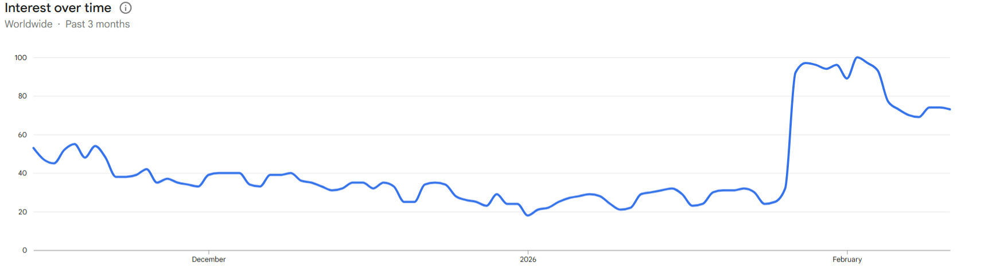
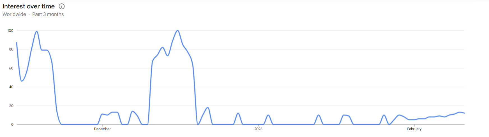

Kimi AI has been trending everywhere lately. After testing it extensively, I’m here to share whether it actually lives up to the hype and if it can compete with the giants.

(Popularity of Kimi AI over the last 3 months)

Kimi offers various features, but what really caught my eye was the Agent mode.

(Kimi AI Features Overview)

The Power of Kimi Agent
The Agent mode is impressively powerful and well-structured. To put it to the test, I provided it with specific data and asked it to build a comprehensive German Language Learning Website.

The results were outstanding. One of the coolest features is the live preview, which allows you to see the website in action immediately, or you can simply download the source files. However, the free tier is limited to 3 Agent uses, which is something to keep in mind.

I’ve been so impressed that I’ve been using Kimi almost exclusively in Agent mode for several weeks now.

🔴🔴🔴
Test Objective
Is Kimi AI actually as good as people say?

Expectations
Since it’s a Chinese AI model, I initially thought it might follow the DeepSeek trend—popping up and then fading away. But after using it, I don't think that will happen. Kimi feels significantly more robust and "sticky."

(DeepSeek search chart - Last 3 Months) 

What Actually Happened
I was genuinely surprised. I didn't expect it to be this polished and capable. It exceeded my initial expectations by a mile.

Conclusion
While there is a 3-use limit for the Agent on the free plan, if you're creative, you can find ways to work around it. For anyone involved in programming or building projects, Kimi is a fantastic tool—and I can only imagine how much more powerful the paid subscription is. It has plenty of other useful features that are definitely worth exploring.
🔴🔴🔴

Date: February 11, 2026